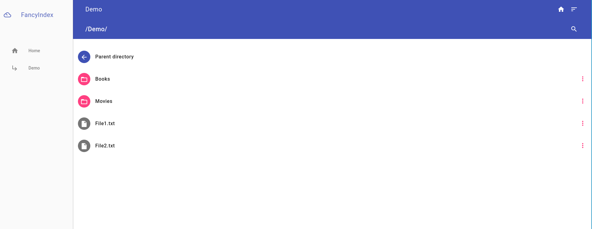

# Nginx-Fancyindex-Theme

A *Material Design* theme for the NGINX Fancy Index module.

### Desktop


### Mobile


## Installation

This [guide](https://neilmenon.com/blog/install-nginx-fancyindex/) may prove helpful with your installation of the NGINX Fancy Index module.

On Debian

    apt-get install git nginx-extras

Sample NGINX configuration:

```bash
server {
    listen 80 default_server;
    client_max_body_size 1G;
    
    location / {
        root /<path_nginx_root>;
        fancyindex on;
        fancyindex_localtime on;
        fancyindex_name_length 255; # Maximum file name length in bytes, change as you see fit.

        # theme
        fancyindex_header "/fancyindex/header.html";
        fancyindex_footer "/fancyindex/footer.html";
        fancyindex_ignore "fancyindex";

        auth_basic  "Access restricted";
        auth_basic_user_file /etc/nginx/.htpasswd;
    }

}
```

Clone the project and copy its contents to the root directory of NGINX.

    git clone https://github.com/fraoustin/Nginx-Fancyindex-Theme.git
    mkdir /<path_nginx_root>/fancyindex
    cd Nginx-Fancyindex-Theme
    cp -R * /<path_nginx_root>/fancyindex

Change the colour of the interface (optional):

    cd /<path_nginx_root>/fancyindex/mdl
    rm material.min.css 
    cp color/<your-color>.min.css material.min.css


